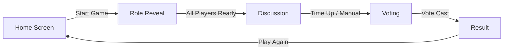

# 🎭 Imposter Android Game - Complete Development Guide

> **Complete roadmap from importing the project to Android Studio to building and testing the app on your Pixel phone**

---

## 📋 Table of Contents

1. [Prerequisites](#prerequisites)
2. [Project Overview](#project-overview)
3. [Importing Project to Android Studio](#importing-project-to-android-studio)
4. [Understanding the Project Structure](#understanding-the-project-structure)
5. [Building the App](#building-the-app)
6. [Testing on Pixel Phone](#testing-on-pixel-phone)
7. [Code Review & Architecture](#code-review--architecture)
8. [Common Issues & Troubleshooting](#common-issues--troubleshooting)
9. [Next Steps & Enhancements](#next-steps--enhancements)

---

## Prerequisites

### Required Software

1. **Android Studio** (Latest stable version recommended)
   - Download from: https://developer.android.com/studio
   - Minimum version: Android Studio Hedgehog (2023.1.1) or later

2. **Java Development Kit (JDK)**
   - JDK 17 is required (as specified in the project)
   - Android Studio usually bundles JDK, but you can verify:
     ```bash
     java -version
     ```

3. **Android SDK**
   - Minimum SDK: API 26 (Android 8.0)
   - Target SDK: API 34 (Android 14)
   - Compile SDK: API 34

### Pixel Phone Setup

1. **Enable Developer Options**
   - Go to `Settings` → `About phone`
   - Tap `Build number` 7 times
   - You'll see a message: "You are now a developer!"

2. **Enable USB Debugging**
   - Go to `Settings` → `System` → `Developer options`
   - Enable `USB debugging`
   - Enable `Install via USB` (if available)

3. **USB Cable**
   - Use a good quality USB cable that supports data transfer
   - Some cables are charge-only and won't work for development

---

## Project Overview

### What is Imposter?

Imposter is a **local multiplayer social deduction game** for Android, inspired by games like Mafia and Among Us. Key features:

- 🎮 **Pass-and-play**: Single device shared among players
- 🔒 **Offline-first**: No internet required
- 📊 **Persistent statistics**: Local database using Room
- 🎨 **Modern UI**: Built with Jetpack Compose
- 🏗️ **Clean Architecture**: MVVM pattern with Hilt DI

### Technology Stack

| Component | Technology |
|-----------|-----------|
| Language | Kotlin |
| UI Framework | Jetpack Compose |
| Architecture | MVVM (Model-View-ViewModel) |
| Database | Room (SQLite) |
| Async Operations | Kotlin Coroutines + StateFlow |
| Dependency Injection | Hilt |
| Navigation | Navigation Compose |
| Build System | Gradle (Kotlin DSL) |

### Material Design 3 Implementation

The app features a complete **Material Design 3** redesign with modern UI components and optimized animations:

#### Theme System
- **Color Scheme**: Complete MD3 color tokens (Primary, Secondary, Tertiary)
- **Semantic Colors**: Success, Error, Warning, Info
- **Surface Variants**: Proper elevation hierarchy
- **Typography**: Full MD3 type scale (Display, Headline, Title, Body, Label)
- **Dynamic Color**: Support for Android 12+ dynamic theming

#### UI Components
- `ElevatedCard` - Cards with proper elevation and shadows
- `ModalBottomSheet` - Modern bottom sheets for configuration
- `LinearProgressIndicator` - Progress tracking
- `CircularProgressIndicator` - Timer visualization
- `FilledTonalButton` - Primary action buttons
- `OutlinedButton` - Secondary actions

#### Animation Enhancements
- **Duration**: Optimized from 300ms to 200ms for snappier feel
- **Spring Physics**: Natural movement with `DampingRatioMediumBouncy`
- **Transitions**: Smooth fade and scale animations
- **List Items**: `animateItemPlacement` for reordering

See [Material Design 3 Guidelines](https://m3.material.io/) for design principles.

---

## Importing Project to Android Studio

### Step 1: Clone/Open the Project

1. **If using Git:**
   ```bash
   cd /Users/knownassurajit/Documents/Codes/GitHub/
   # Project already exists at: impstr/Imposter
   ```

2. **Open in Android Studio:**
   - Launch Android Studio
   - Click `File` → `Open`
   - Navigate to: `/Users/knownassurajit/Documents/Codes/GitHub/impstr/Imposter`
   - Select the `Imposter` folder (the one containing `build.gradle.kts`)
   - Click `Open`

### Step 2: Initial Sync

1. Android Studio will automatically detect the Gradle project
2. You'll see a notification: **"Gradle files have changed since last project sync"**
3. Click **"Sync Now"**
4. Wait for the sync to complete (this may take 2-5 minutes on first run)

> **⚠️ Common Issue:** If sync fails, see [Troubleshooting - Gradle Sync Issues](#gradle-sync-issues)

### Step 3: Verify SDK Installation

1. Go to `Tools` → `SDK Manager`
2. Under **SDK Platforms** tab, ensure these are installed:
   - ✅ Android 14.0 (API 34)
   - ✅ Android 8.0 (API 26)

3. Under **SDK Tools** tab, ensure these are installed:
   - ✅ Android SDK Build-Tools 34
   - ✅ Android SDK Platform-Tools
   - ✅ Android SDK Tools
   - ✅ Google Play services

4. Click `Apply` to install any missing components

### Step 4: Configure Gradle JDK

1. Go to `File` → `Settings` (or `Android Studio` → `Preferences` on Mac)
2. Navigate to `Build, Execution, Deployment` → `Build Tools` → `Gradle`
3. Under **Gradle JDK**, select **JDK 17** (or higher)
4. Click `Apply` and `OK`

---

## Understanding the Project Structure

### Directory Layout

```
Imposter/
├── app/
│   ├── build.gradle.kts          # App-level build configuration
│   └── src/
│       └── main/
│           ├── AndroidManifest.xml
│           ├── java/com/example/imposter/
│           │   ├── ImposterApp.kt              # Application class (Hilt entry point)
│           │   ├── MainActivity.kt             # Main activity with navigation
│           │   ├── data/                       # Data layer
│           │   │   ├── AppDatabase.kt          # Room database
│           │   │   ├── GameDao.kt              # Data access object
│           │   │   └── GameResult.kt           # Entity model
│           │   ├── di/                         # Dependency injection
│           │   │   └── DatabaseModule.kt       # Hilt module for database
│           │   ├── ui/
│           │   │   ├── screens/                # Compose screens
│           │   │   │   ├── HomeScreen.kt       # Game lobby
│           │   │   │   ├── GameSetupScreen.kt  # Player setup
│           │   │   │   ├── RoleRevealScreen.kt # Word/role reveal
│           │   │   │   ├── DiscussionScreen.kt # Discussion phase
│           │   │   │   ├── VotingScreen.kt     # Voting phase
│           │   │   │   └── ResultScreen.kt     # Game results
│           │   │   ├── theme/                  # Material Design 3 theming
│           │   │   │   ├── Color.kt            # MD3 color system
│           │   │   │   ├── Theme.kt            # MD3 theme configuration
│           │   │   │   └── Type.kt             # MD3 typography scale
│           │   │   └── viewmodel/
│           │   │       └── GameViewModel.kt    # Game state management
│           │   └── res/
│           │       ├── values/
│           │       │   └── strings.xml
│           │       └── xml/
│           │           ├── backup_rules.xml
│           │           └── data_extraction_rules.xml
├── build.gradle.kts              # Project-level build configuration
└── settings.gradle.kts           # Gradle settings
```

### Key Files Explained

#### 1. **ImposterApp.kt**
```kotlin
@HiltAndroidApp
class ImposterApp : Application()
```
- Application entry point
- `@HiltAndroidApp` annotation enables Hilt dependency injection

#### 2. **MainActivity.kt**
- Single activity architecture
- Sets up Jetpack Compose navigation
- Defines navigation graph with 6 screens:
  - `home` → Game lobby
  - `setup` → Player configuration
  - `reveal` → Role/word reveal (pass-and-play)
  - `discussion` → Timed discussion phase
  - `voting` → Player voting
  - `result` → Game outcome

**⚠️ KNOWN ISSUE:** Lines 27-28 are duplicated. See [Code Issues](#code-issues-to-fix)

#### 3. **GameViewModel.kt**
- Manages game state using `StateFlow`
- Implements game logic:
  - Random imposter selection
  - Timer management (3-minute discussion)
  - Vote processing
  - Game result persistence

#### 4. **Room Database**
- **AppDatabase.kt**: Database configuration
- **GameDao.kt**: Database queries
- **GameResult.kt**: Entity storing:
  - Winner (Crewmates/Imposter)
  - Imposter name
  - Secret word
  - Game duration
  - Timestamp

#### 5. **Build Configuration**

**Project-level `build.gradle.kts`:**
```kotlin
plugins {
    id("com.android.application") version "8.2.0"
    id("org.jetbrains.kotlin.android") version "1.9.20"
    id("com.google.dagger.hilt.android") version "2.50"
    id("com.google.devtools.ksp") version "1.9.20-1.0.14"
}
```

**App-level `build.gradle.kts`:**
- Namespace: `com.example.imposter`
- Min SDK: 26 (Android 8.0)
- Target SDK: 34 (Android 14)
- Compose enabled with Material 3

---

## Building the App

### Build Variants

Android projects have two main build variants:

1. **Debug** (default)
   - Includes debugging symbols
   - Not optimized
   - Signed with debug keystore
   - Use for development

2. **Release**
   - Optimized and minified
   - Requires signing configuration
   - Use for production

### Building Debug APK

#### Method 1: Using Android Studio UI

1. Click `Build` → `Build Bundle(s) / APK(s)` → `Build APK(s)`
2. Wait for the build to complete
3. Click the notification **"locate"** to find the APK
4. APK location: `app/build/outputs/apk/debug/app-debug.apk`

#### Method 2: Using Gradle Command Line

```bash
cd /Users/knownassurajit/Documents/Codes/GitHub/impstr/Imposter

# Build debug APK
./gradlew assembleDebug

# APK will be at: app/build/outputs/apk/debug/app-debug.apk
```

#### Method 3: Using Terminal in Android Studio

1. Open Terminal in Android Studio (bottom panel)
2. Run:
   ```bash
   ./gradlew assembleDebug
   ```

### Building Release APK (For Production)

> **Note:** Release builds require signing configuration. For testing, use debug builds.

```bash
./gradlew assembleRelease
```

### Cleaning Build

If you encounter build issues:

```bash
# Clean build artifacts
./gradlew clean

# Clean and rebuild
./gradlew clean assembleDebug
```

---

## Testing on Pixel Phone

### Step 1: Connect Your Pixel Phone

1. Connect your Pixel phone via USB cable
2. On your phone, you'll see a prompt: **"Allow USB debugging?"**
3. Check **"Always allow from this computer"**
4. Tap **"Allow"**

### Step 2: Verify Device Connection

#### In Android Studio:
1. Look at the device dropdown (top toolbar)
2. You should see your Pixel device listed (e.g., "Pixel 7 Pro")

#### Using Command Line:
```bash
# List connected devices
adb devices

# Expected output:
# List of devices attached
# 1A2B3C4D5E6F    device
```

> **⚠️ Troubleshooting:** If device shows as "unauthorized", check your phone for the USB debugging prompt

### Step 3: Run the App

#### Method 1: Android Studio (Recommended)

1. Select your Pixel device from the device dropdown
2. Click the green **Run** button (▶️) or press `Ctrl+R` (Mac: `Cmd+R`)
3. Android Studio will:
   - Build the APK
   - Install it on your phone
   - Launch the app automatically

#### Method 2: Install APK Manually

```bash
# Install debug APK
adb install app/build/outputs/apk/debug/app-debug.apk

# If app is already installed, use -r to reinstall
adb install -r app/build/outputs/apk/debug/app-debug.apk

# Launch the app
adb shell am start -n com.example.imposter/.MainActivity
```

### Step 4: Testing the Game Flow

1. **Home Screen (Lobby)**
   - You'll see 4 mock players: Sarah (You), Marcus, Elena, David
   - Room #8392
   - Category: Animals
   - Tap **"Start Game"**

2. **Role Reveal Screen**
   - Pass the phone to each player
   - Each player sees either:
     - The secret word (e.g., "Lion") if they're a crewmate
     - "You are the IMPOSTER!" if they're the imposter
   - Tap **"Next"** after all players have seen their roles

3. **Discussion Screen**
   - 3-minute timer starts
   - Players discuss verbally to identify the imposter
   - Tap **"Start Voting"** when ready

4. **Voting Screen**
   - Each player votes for who they think is the imposter
   - Tap a player's name to vote

5. **Result Screen**
   - Shows whether Crewmates or Imposter won
   - Displays the actual imposter
   - Shows the secret word
   - Tap **"Play Again"** to restart

### Step 5: Viewing Logs (Debugging)

#### Using Logcat in Android Studio:
1. Click **Logcat** tab (bottom panel)
2. Filter by package: `com.example.imposter`
3. You'll see app logs, crashes, and debug messages

#### Using Command Line:
```bash
# View all logs
adb logcat

# Filter by app package
adb logcat | grep "com.example.imposter"

# Clear logs
adb logcat -c
```

---

## Code Review & Architecture

### Architecture Pattern: MVVM

```
┌─────────────────────────────────────────────────┐
│                   UI Layer                      │
│  (Jetpack Compose Screens)                     │
│  - HomeScreen.kt                                │
│  - RoleRevealScreen.kt                          │
│  - DiscussionScreen.kt                          │
│  - VotingScreen.kt                              │
│  - ResultScreen.kt                              │
└──────────────────┬──────────────────────────────┘
                   │ observes StateFlow
                   ▼
┌─────────────────────────────────────────────────┐
│                ViewModel Layer                  │
│  (GameViewModel.kt)                             │
│  - Manages UI state (GameState)                 │
│  - Business logic (game rules)                  │
│  - Communicates with Repository                 │
└──────────────────┬──────────────────────────────┘
                   │ uses
                   ▼
┌─────────────────────────────────────────────────┐
│                 Data Layer                      │
│  (Room Database)                                │
│  - AppDatabase.kt                               │
│  - GameDao.kt (queries)                         │
│  - GameResult.kt (entity)                       │
└─────────────────────────────────────────────────┘
```

### State Management

The app uses **unidirectional data flow**:

1. **UI** emits user actions (e.g., "Start Game" button click)
2. **ViewModel** processes the action and updates `GameState`
3. **UI** observes `StateFlow<GameState>` and recomposes

```kotlin
// GameState data class
data class GameState(
    val phase: GamePhase = GamePhase.SETUP,
    val players: List<PlayerState> = emptyList(),
    val category: String = "Animals",
    val secretWord: String = "Lion",
    val imposterName: String = "",
    val timeLeft: Long = 0,
    val totalTime: Long = 0,
    val winner: String? = null
)
```

### Dependency Injection with Hilt

```kotlin
// Application class
@HiltAndroidApp
class ImposterApp : Application()

// Activity
@AndroidEntryPoint
class MainActivity : ComponentActivity()

// ViewModel
@HiltViewModel
class GameViewModel @Inject constructor(
    private val gameDao: GameDao
) : ViewModel()

// Module providing database
@Module
@InstallIn(SingletonComponent::class)
object DatabaseModule {
    @Provides
    @Singleton
    fun provideDatabase(@ApplicationContext context: Context): AppDatabase {
        return Room.databaseBuilder(
            context,
            AppDatabase::class.java,
            "imposter_db"
        ).build()
    }
}
```

### Navigation Flow



### Room Database Schema

**Table: `game_results`**

| Column | Type | Description |
|--------|------|-------------|
| id | INTEGER | Primary key (auto-increment) |
| winner | TEXT | "Crewmates" or "Imposter" |
| imposterName | TEXT | Name of the imposter |
| word | TEXT | Secret word used |
| durationSeconds | INTEGER | Game duration |
| timestamp | INTEGER | Unix timestamp |

---

## Common Issues & Troubleshooting

### Gradle Sync Issues

#### Issue: "Gradle sync failed: Could not resolve dependencies"

**Solution 1: Check Internet Connection**
```bash
# Test connection to Maven Central
ping repo.maven.apache.org
```

**Solution 2: Invalidate Caches**
1. Go to `File` → `Invalidate Caches`
2. Check all options
3. Click `Invalidate and Restart`

**Solution 3: Update Gradle Wrapper**
```bash
cd /Users/knownassurajit/Documents/Codes/GitHub/impstr/Imposter
./gradlew wrapper --gradle-version=8.2
```

**Solution 4: Clear Gradle Cache**
```bash
# macOS/Linux
rm -rf ~/.gradle/caches/

# Then sync again in Android Studio
```

#### Issue: "Unsupported Java version"

**Error:** `Android Gradle plugin requires Java 17 to run`

**Solution:**
1. Go to `File` → `Settings` → `Build, Execution, Deployment` → `Build Tools` → `Gradle`
2. Set **Gradle JDK** to **JDK 17**
3. Click `Apply` and sync again

### Build Errors

#### Issue: "Duplicate class found"

**Error in MainActivity.kt:** Lines 27-28 are duplicated

**Fix:**
```kotlin
// BEFORE (lines 22-35):
@AndroidEntryPoint
class MainActivity : ComponentActivity() {
    override fun onCreate(savedInstanceState: Bundle?) {
        super.onCreate(savedInstanceState)
        setContent {
            ImposterTheme {
@AndroidEntryPoint  // ❌ DUPLICATE
class MainActivity : ComponentActivity() {  // ❌ DUPLICATE
    override fun onCreate(savedInstanceState: Bundle?) {
        super.onCreate(savedInstanceState)
        setContent {
            ImposterTheme {
                Surface(

// AFTER (corrected):
@AndroidEntryPoint
class MainActivity : ComponentActivity() {
    override fun onCreate(savedInstanceState: Bundle?) {
        super.onCreate(savedInstanceState)
        setContent {
            ImposterTheme {
                Surface(
```

**To fix:**
1. Open `MainActivity.kt`
2. Delete lines 27-28 (the duplicate class declaration)
3. Ensure proper closing braces at the end

#### Issue: "Unresolved reference: viewModel"

**Error:** `Unresolved reference: viewModel` in MainActivity.kt line 39

**Solution:** Add missing import:
```kotlin
import androidx.lifecycle.viewmodel.compose.viewModel
```

Or use Hilt's `hiltViewModel()`:
```kotlin
import androidx.hilt.navigation.compose.hiltViewModel

// In composable:
val viewModel: GameViewModel = hiltViewModel()
```

#### Issue: "Cannot access database on main thread"

**Error:** `Cannot access database on the main thread`

**Solution:** Room operations are already wrapped in `viewModelScope.launch { }` in GameViewModel. If you see this error, ensure all DAO calls are in coroutines:

```kotlin
// ✅ Correct
viewModelScope.launch {
    gameDao.insertGame(result)
}

// ❌ Wrong
gameDao.insertGame(result)  // Blocks main thread
```

### Device Connection Issues

#### Issue: "No devices detected"

**Checklist:**
1. ✅ USB debugging enabled on phone
2. ✅ USB cable supports data transfer (not charge-only)
3. ✅ USB debugging prompt accepted on phone
4. ✅ Phone is unlocked

**Solution 1: Restart ADB**
```bash
adb kill-server
adb start-server
adb devices
```

**Solution 2: Revoke USB Debugging Authorizations**
1. On phone: `Settings` → `Developer options`
2. Tap **"Revoke USB debugging authorizations"**
3. Disconnect and reconnect USB cable
4. Accept the new authorization prompt

**Solution 3: Check USB Mode**
1. When phone is connected, pull down notification shade
2. Tap the USB notification
3. Select **"File Transfer"** or **"PTP"** mode

#### Issue: "Device unauthorized"

**Solution:**
1. Check your phone screen for USB debugging prompt
2. Tap **"Always allow from this computer"**
3. Tap **"Allow"**
4. Run `adb devices` again

### App Crashes

#### Issue: App crashes on launch

**Step 1: Check Logcat**
```bash
adb logcat | grep "AndroidRuntime"
```

**Common causes:**

1. **Missing Hilt setup**
   - Ensure `ImposterApp` is declared in `AndroidManifest.xml`:
     ```xml
     <application
         android:name=".ImposterApp"
         ...>
     ```

2. **Database migration issues**
   - Clear app data:
     ```bash
     adb shell pm clear com.example.imposter
     ```

3. **Compose version mismatch**
   - Verify `kotlinCompilerExtensionVersion` matches Kotlin version:
     ```kotlin
     // In app/build.gradle.kts
     composeOptions {
         kotlinCompilerExtensionVersion = "1.5.6"  // Must match Kotlin 1.9.20
     }
     ```

#### Issue: "Theme.Imposter not found"

**Error:** `java.lang.IllegalArgumentException: Theme.Imposter not found`

**Solution:** Create theme resources:

1. Create `app/src/main/res/values/themes.xml`:
```xml
<?xml version="1.0" encoding="utf-8"?>
<resources>
    <style name="Theme.Imposter" parent="android:Theme.Material.Light.NoActionBar" />
</resources>
```

2. Or remove theme from `AndroidManifest.xml` and rely on Compose theme:
```xml
<!-- Remove android:theme from application tag -->
<application
    android:name=".ImposterApp"
    ...>
```

### Performance Issues

#### Issue: Slow build times

**Solution 1: Enable Gradle Daemon**
```bash
# Add to ~/.gradle/gradle.properties
org.gradle.daemon=true
org.gradle.parallel=true
org.gradle.caching=true
```

**Solution 2: Increase Gradle Memory**
```bash
# Add to gradle.properties in project root
org.gradle.jvmargs=-Xmx4096m -XX:MaxMetaspaceSize=512m
```

**Solution 3: Use Build Cache**
```bash
./gradlew assembleDebug --build-cache
```

#### Issue: App feels laggy on device

**Solution 1: Enable R8 (already enabled in release builds)**
```kotlin
buildTypes {
    release {
        isMinifyEnabled = true  // Enable ProGuard/R8
        isShrinkResources = true
    }
}
```

**Solution 2: Profile with Android Profiler**
1. Run app in debug mode
2. Open `View` → `Tool Windows` → `Profiler`
3. Check CPU, Memory, and Network usage

---

## Next Steps & Enhancements

### Immediate Fixes Required

1. **Fix MainActivity.kt Duplicate Code**
   - Remove lines 27-28 (duplicate class declaration)
   - Test app launch after fix

2. **Add Missing Theme Resources**
   - Create `themes.xml` or remove theme references
   - Ensure app doesn't crash on launch

3. **Implement Word List**
   - Currently hardcoded to "Lion"
   - Add a word repository with categories:
     ```kotlin
     object WordRepository {
         val categories = mapOf(
             "Animals" to listOf("Lion", "Elephant", "Giraffe", ...),
             "Food" to listOf("Pizza", "Burger", "Sushi", ...),
             "Countries" to listOf("France", "Japan", "Brazil", ...)
         )
     }
     ```

### Feature Enhancements

#### 1. Dynamic Player Management
**Current:** Hardcoded 4 players  
**Enhancement:** Allow adding/removing players dynamically

```kotlin
// Add to GameViewModel
fun addPlayer(name: String) {
    _uiState.update { state ->
        state.copy(
            players = state.players + PlayerState(name)
        )
    }
}

fun removePlayer(name: String) {
    _uiState.update { state ->
        state.copy(
            players = state.players.filter { it.name != name }
        )
    }
}
```

#### 2. Statistics Screen
**Enhancement:** Show game history from Room database

```kotlin
// In GameViewModel
val gameHistory: StateFlow<List<GameResult>> = gameDao.getAllGames()
    .stateIn(viewModelScope, SharingStarted.Lazily, emptyList())

// New screen: StatisticsScreen.kt
@Composable
fun StatisticsScreen(viewModel: GameViewModel) {
    val history by viewModel.gameHistory.collectAsState()
    
    LazyColumn {
        items(history) { game ->
            GameHistoryItem(game)
        }
    }
}
```

#### 3. Customizable Timer
**Current:** Fixed 3-minute discussion  
**Enhancement:** Let host choose duration

```kotlin
// Add to GameState
data class GameState(
    ...
    val discussionDuration: Long = 180  // seconds
)

// UI: Slider to select duration (1-10 minutes)
```

#### 4. Sound Effects & Haptics
**Enhancement:** Add audio feedback

```kotlin
// Add to app/build.gradle.kts
implementation("androidx.media3:media3-exoplayer:1.2.0")

// Play sound on vote
val mediaPlayer = MediaPlayer.create(context, R.raw.vote_sound)
mediaPlayer.start()

// Haptic feedback
val vibrator = context.getSystemService(Vibrator::class.java)
vibrator.vibrate(VibrationEffect.createOneShot(100, VibrationEffect.DEFAULT_AMPLITUDE))
```

#### 5. Animations
**Enhancement:** Add screen transitions and micro-interactions

```kotlin
// Animated navigation
composable(
    "voting",
    enterTransition = { slideInHorizontally { it } },
    exitTransition = { slideOutHorizontally { -it } }
) { VotingScreen(...) }

// Animated vote button
val scale by animateFloatAsState(if (isSelected) 1.1f else 1.0f)
Box(modifier = Modifier.scale(scale)) {
    VoteButton(...)
}
```

### Code Quality Improvements

#### 1. Add Unit Tests
```kotlin
// app/src/test/java/com/example/imposter/GameViewModelTest.kt
@Test
fun `startGame assigns random imposter`() {
    val viewModel = GameViewModel(fakeGameDao)
    viewModel.startGame()
    
    val players = viewModel.uiState.value.players
    val imposterCount = players.count { it.isImposter }
    
    assertEquals(1, imposterCount)
}
```

#### 2. Add UI Tests
```kotlin
// app/src/androidTest/java/com/example/imposter/HomeScreenTest.kt
@Test
fun startGameButton_navigatesToRevealScreen() {
    composeTestRule.setContent {
        HomeScreen(viewModel, onStartGame = { /* navigate */ })
    }
    
    composeTestRule.onNodeWithText("Start Game").performClick()
    // Assert navigation occurred
}
```

#### 3. Error Handling
```kotlin
// Add error state to GameState
data class GameState(
    ...
    val error: String? = null
)

// Handle database errors
private fun saveGameResult() {
    viewModelScope.launch {
        try {
            gameDao.insertGame(result)
        } catch (e: Exception) {
            _uiState.update { it.copy(error = "Failed to save game") }
        }
    }
}
```

### Deployment Preparation

#### 1. Generate Signed APK

**Create Keystore:**
```bash
keytool -genkey -v -keystore imposter-release.keystore \
  -alias imposter -keyalg RSA -keysize 2048 -validity 10000
```

**Configure Signing in `app/build.gradle.kts`:**
```kotlin
android {
    signingConfigs {
        create("release") {
            storeFile = file("../imposter-release.keystore")
            storePassword = System.getenv("KEYSTORE_PASSWORD")
            keyAlias = "imposter"
            keyPassword = System.getenv("KEY_PASSWORD")
        }
    }
    
    buildTypes {
        release {
            signingConfig = signingConfigs.getByName("release")
            isMinifyEnabled = true
            proguardFiles(...)
        }
    }
}
```

**Build Release APK:**
```bash
export KEYSTORE_PASSWORD=your_password
export KEY_PASSWORD=your_password
./gradlew assembleRelease
```

#### 2. Generate App Bundle (for Play Store)
```bash
./gradlew bundleRelease
# Output: app/build/outputs/bundle/release/app-release.aab
```

#### 3. Update App Metadata

**Update `app/build.gradle.kts`:**
```kotlin
defaultConfig {
    applicationId = "com.yourdomain.imposter"  // Change from com.example
    versionCode = 1
    versionName = "1.0.0"
}
```

**Create launcher icon:**
1. Right-click `res` → `New` → `Image Asset`
2. Select icon type: Launcher Icons
3. Upload your icon image
4. Generate adaptive icons for all densities

**Add privacy policy:**
- Create `privacy_policy.md`
- Host on GitHub Pages or your website
- Required for Play Store submission

---

## Additional Resources

### Official Documentation
- [Android Developer Guide](https://developer.android.com/guide)
- [Jetpack Compose](https://developer.android.com/jetpack/compose)
- [Room Database](https://developer.android.com/training/data-storage/room)
- [Hilt Dependency Injection](https://developer.android.com/training/dependency-injection/hilt-android)

### Useful Commands

```bash
# Check Gradle version
./gradlew --version

# List all tasks
./gradlew tasks

# Build debug APK
./gradlew assembleDebug

# Build release APK
./gradlew assembleRelease

# Install on device
./gradlew installDebug

# Run tests
./gradlew test

# Run instrumented tests
./gradlew connectedAndroidTest

# Generate code coverage report
./gradlew jacocoTestReport

# Lint check
./gradlew lint

# Check dependencies
./gradlew dependencies

# Clean build
./gradlew clean
```

### ADB Commands

```bash
# List devices
adb devices

# Install APK
adb install app-debug.apk

# Uninstall app
adb uninstall com.example.imposter

# Clear app data
adb shell pm clear com.example.imposter

# View logs
adb logcat

# Take screenshot
adb shell screencap /sdcard/screenshot.png
adb pull /sdcard/screenshot.png

# Record screen
adb shell screenrecord /sdcard/demo.mp4
adb pull /sdcard/demo.mp4

# Check app info
adb shell dumpsys package com.example.imposter
```

---

## Summary Checklist

### Setup Phase
- [ ] Install Android Studio
- [ ] Install JDK 17
- [ ] Install Android SDK (API 26 & 34)
- [ ] Enable USB debugging on Pixel phone
- [ ] Clone/open project in Android Studio
- [ ] Sync Gradle successfully

### Build Phase
- [ ] Fix MainActivity.kt duplicate code
- [ ] Build debug APK successfully
- [ ] No build errors or warnings

### Testing Phase
- [ ] Connect Pixel phone via USB
- [ ] Device shows in Android Studio
- [ ] Install app on phone
- [ ] Test complete game flow:
  - [ ] Home screen loads
  - [ ] Start game works
  - [ ] Role reveal shows correctly
  - [ ] Discussion timer works
  - [ ] Voting works
  - [ ] Results display correctly
  - [ ] Play again resets game

### Next Steps
- [ ] Implement dynamic word selection
- [ ] Add player management (add/remove)
- [ ] Create statistics screen
- [ ] Add sound effects
- [ ] Write unit tests
- [ ] Prepare for release (signing, icons, etc.)

---

## Getting Help

If you encounter issues not covered in this guide:

1. **Check Logcat** for error messages
2. **Google the error** - Stack Overflow usually has answers
3. **Check Android Studio's Build Output** for detailed error info
4. **Clean and rebuild** - solves 50% of weird issues
5. **Invalidate caches** - solves another 25%
6. **Ask for help** with specific error messages and logs

---

**Happy Coding! 🎮**

*Last updated: 2026-02-12*
