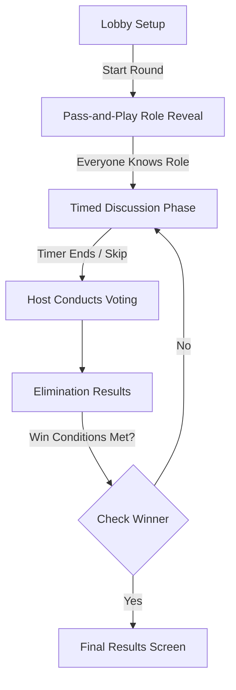

<div align="center">
  
</div>

<div align="center">
  <em>The title "IMPSTR" represents the players. The letter 'O' has been eliminated from the game, and we are highlighting 'M' because it is the imposter.</em>
</div>

<br>

<div align="center">

**A modern, offline-first social deduction game for Android built with Material Design 3**

[](https://m3.material.io/)
[](https://developer.android.com/jetpack/compose)
[](https://kotlinlang.org/)
[](https://developer.android.com/topic/security/data)
[](https://developer.android.com/about/versions/12/behavior-changes-12)
[](https://developer.android.com/about/versions/)
[](#)

</div>

---

## Table of Contents

- [Project Overview](#project-overview)
- [Gameplay & Product Highlights](#gameplay--product-highlights)
- [Architecture](#architecture)
- [Game State Machine](#game-state-machine)
- [Security Model](#security-model)
- [Performance Notes](#performance-notes)
- [Code Documentation Standards](#code-documentation-standards)
- [Local Development](#local-development)
- [QA/Release Checklist](#qarelease-checklist)
- [License & Developer](#license--developer)

---

## Project Overview

**IMPSTR** is an offline, pass-and-play social deduction game for Android. 3 to 10 players share one device: crewmates see the secret word, while the imposter must infer context and avoid elimination.

This README separates **player-facing gameplay details** from **engineering documentation** so new contributors can onboard quickly without losing product context.

## Gameplay & Product Highlights

### What players get

| Feature | Description |
| :--- | :--- |
| 🎮 **Pass-and-Play Multiplayer** | Play together in the same room using one Android device. Supports 3–10 players. |
| 🔒 **Fully Offline Setup** | No network required and no cloud dependency during play. |
| 🎨 **Material Design 3 UI** | Jetpack Compose + Material 3 with dark mode and animated interactions. |
| 📂 **Word Library** | Category-based word generation to keep rounds varied. |
| 🎯 **Strategic Social Play** | Timed discussion, host-led voting, eliminations, and win conditions. |

### Match flow



### How to play (quick version)

1. **Setup**: configure players, imposter count, and category.
2. **Pass & Reveal**: each player privately reveals their role card.
3. **Discussion**: players discuss under a timer.
4. **Host Voting**: suspected players are selected for elimination.
5. **Results**: game ends when crewmates remove all imposters or imposters reach parity.

---

## Architecture

IMPSTR follows **MVVM + UDF**:

- **UI (Compose screens)** renders immutable state and emits user actions.
- **ViewModel** owns `MutableStateFlow<GameState>` and game transition logic.
- **Data/Domain** provide words, shuffling, and persistence.

### Module/package map (anchor paths)

- Application entry: [`IMPSTR/app/src/main/java/com/game/impstr/IMPSTRApp.kt`](IMPSTR/app/src/main/java/com/game/impstr/IMPSTRApp.kt)
- Activity host: [`IMPSTR/app/src/main/java/com/game/impstr/MainActivity.kt`](IMPSTR/app/src/main/java/com/game/impstr/MainActivity.kt)
- ViewModel + state machine: [`IMPSTR/app/src/main/java/com/game/impstr/ui/viewmodel/GameViewModel.kt`](IMPSTR/app/src/main/java/com/game/impstr/ui/viewmodel/GameViewModel.kt)
- Word data source: [`IMPSTR/app/src/main/java/com/game/impstr/data/WordRepository.kt`](IMPSTR/app/src/main/java/com/game/impstr/data/WordRepository.kt)
- Use case (player randomization): [`IMPSTR/app/src/main/java/com/game/impstr/domain/usecase/ShufflePlayersUseCase.kt`](IMPSTR/app/src/main/java/com/game/impstr/domain/usecase/ShufflePlayersUseCase.kt)
- Screen layer: [`IMPSTR/app/src/main/java/com/game/impstr/ui/screens/`](IMPSTR/app/src/main/java/com/game/impstr/ui/screens/)
- Reusable UI components: [`IMPSTR/app/src/main/java/com/game/impstr/ui/components/`](IMPSTR/app/src/main/java/com/game/impstr/ui/components/)
- Theme system: [`IMPSTR/app/src/main/java/com/game/impstr/ui/theme/`](IMPSTR/app/src/main/java/com/game/impstr/ui/theme/)

### MVVM/UDF flow

1. User interacts with screen composables.
2. Screen sends intent-like calls to `GameViewModel`.
3. `GameViewModel` updates `_uiState` (`MutableStateFlow<GameState>`).
4. Screens observe `uiState` via lifecycle-aware collection and recompose.

---

## Game State Machine

`GamePhase` lives in `GameViewModel.kt` and drives all screens.

### Phases

- `SETUP`
- `ROLE_REVEAL`
- `DISCUSSION`
- `HOST_VOTING`
- `VOTING_RESULTS`
- `RESULT`

### Transition map

- `SETUP -> ROLE_REVEAL`: `startGame()`.
- `ROLE_REVEAL -> DISCUSSION`: `startDiscussionPhase()` after reveal loop.
- `DISCUSSION -> HOST_VOTING`: timer completion or manual phase advance.
- `HOST_VOTING -> VOTING_RESULTS`: `castVotes(...)` with elimination resolution.
- `VOTING_RESULTS -> DISCUSSION`: continue to next round when no winner.
- `VOTING_RESULTS -> RESULT`: winner detected.
- `DISCUSSION/HOST_VOTING/VOTING_RESULTS -> RESULT`: winner check after game logic updates.
- `RESULT -> SETUP`: `resetGame()`.

---

## Security Model

- **Encrypted local config**: `EncryptedSharedPreferences` with `MasterKey` (`AES256_GCM`) stores category, imposter count, and player names.
- **Fallback behavior**: when crypto setup is unavailable (e.g., mocked test context), preferences fallback to standard `SharedPreferences` to keep tests deterministic.
- **Backup policy**: app manifest sets `android:allowBackup="false"`.
- **Screenshot policy (recommended)**:
  - Keep role-reveal content private in shared environments.
  - Do not capture or share screenshots that expose active secret words/roles.
  - For QA artifacts, use non-sensitive test states (e.g., setup or neutral screens).

---

## Performance Notes

- **Timer jobs**: discussion/game duration tracking runs in controlled coroutine jobs, with cancellation when phases reset.
- **Recomposition strategy**:
  - Central immutable `GameState` model.
  - `@Stable` annotations on state models to reduce avoidable recompositions.
  - Lifecycle-aware `collectAsStateWithLifecycle()` in screens.
- **Data structures**:
  - Player and elimination state represented as immutable lists copied on update.
  - Phase changes and vote outcomes are computed in the ViewModel before publishing state.

---

## Code Documentation Standards

- Public classes, enums, and non-trivial functions should include concise **KDoc** (`/** ... */`) covering intent, key params, and side effects.
- Inline comments should explain **why**, not restate **what**.
- State-transition functions should document preconditions (current `GamePhase`) and resulting phase.
- Keep docs synchronized with behavior whenever modifying `GameState`, `GamePhase`, or persistence keys.

---

## Local Development

### Requirements

- Android Studio Ladybug (or newer)
- JDK 17
- Android SDK with min API 31 / target API 36

### Build & run

```bash
# From repository root
cd IMPSTR

# Debug APK
./gradlew assembleDebug

# Install on connected device/emulator
adb install -r app/build/outputs/apk/debug/app-debug.apk
```

### Test commands

```bash
cd IMPSTR

# Unit tests
./gradlew testDebugUnitTest

# Lint checks
./gradlew lintDebug
```

---

## QA/Release Checklist

- [ ] `./gradlew lintDebug` completed and reviewed.
- [ ] `./gradlew testDebugUnitTest` passes locally.
- [ ] Manual smoke test across setup, reveal, discussion, voting, and result screens.
- [ ] Confirm encrypted preference reads/writes still work after state/schema changes.
- [ ] Verify `android:allowBackup="false"` remains in manifest.
- [ ] Release build validation: `./gradlew assembleRelease`.
- [ ] Release hardening retained (`isMinifyEnabled = true`, `isShrinkResources = true`).
- [ ] Signing configuration and Play Console upload performed in secure CI/release environment only.

---

## License & Developer

**Created and Maintained with 💙 by [Surajit Das](https://github.com/knownassurajit)**  
*This project is built for educational and personal use. All rights reserved © 2026 Surajit Das.*

<br>
<div align="center">
  <h3>Trust no one. Have fun! 🎭</h3>
</div>
