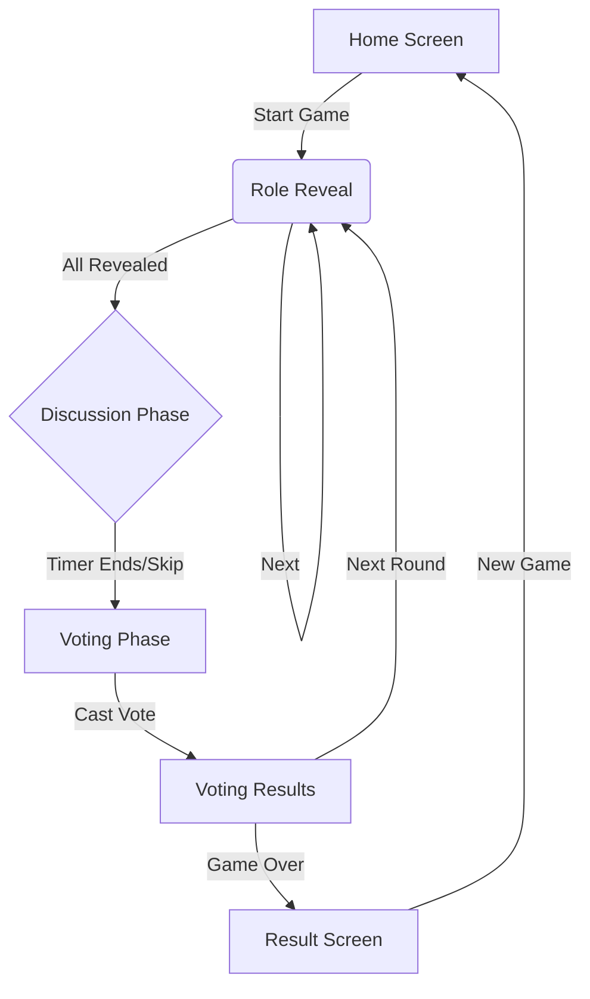

# 🎭 Imposter - Android Social Deduction Game

<div align="center">

**A modern, offline-first social deduction game for Android**

[](https://m3.material.io/)
[](https://developer.android.com/jetpack/compose)
[](https://kotlinlang.org/)
[](https://developer.android.com/about/versions/oreo)

</div>

---

## 📖 Overview

**Imposter** is a local multiplayer social deduction game inspired by Mafia and Among Us. Players pass a single device around, with one player secretly assigned as the "imposter" while others receive a secret word. Through discussion and voting, players must identify the imposter before they blend in!

### ✨ Key Features

- 🎮 **Pass-and-Play Multiplayer** - Single device shared among 3-10 players
- 🔒 **Fully Offline** - No internet connection required
- 🎨 **Material Design 3** - Modern, polished UI with smooth animations
- 📊 **Game History** - Persistent statistics using Room database
- ⚡ **Optimized Performance** - Smooth 200ms animations with spring physics
- 🌙 **Dark Theme** - Beautiful dark mode design

---

## 🎯 How to Play

1. **Setup** - Configure players (3-10), number of imposters, and category
2. **Role Reveal** - Each player privately views their role (word or imposter)
3. **Discussion** - Players discuss for 3 minutes to identify suspicious behavior
4. **Voting** - Everyone votes for who they think is the imposter
5. **Results** - See if the crewmates caught the imposter or if they won!

---

## 🛠️ Technology Stack

| Component | Technology |
|-----------|-----------|
| **Language** | Kotlin |
| **UI Framework** | Jetpack Compose with Material 3 |
| **Architecture** | MVVM (Model-View-ViewModel) |
| **Database** | Room (SQLite) |
| **Async** | Kotlin Coroutines + StateFlow |
| **DI** | Hilt |
| **Navigation** | Navigation Compose |
| **Build System** | Gradle (Kotlin DSL) |

---

## 📱 Requirements

- **Android 8.0 (API 26)** or higher
- **~15 MB** storage space
- **No internet connection** required

---

## 🚀 Getting Started

### For Players

1. Download the APK from releases
2. Install on your Android device
3. Gather 3-10 friends
4. Start playing!

### For Developers

See the comprehensive [**GUIDE.md**](GUIDE.md) for:
- Setting up Android Studio
- Building from source
- Testing on devices
- Architecture details
- Troubleshooting

**Quick Build:**
```bash
cd Imposter
./gradlew assembleDebug
```

---

## 🎨 Material Design 3 Redesign

The app has been completely redesigned with **Material Design 3** principles:

### Visual Enhancements
- ✅ Complete MD3 color system with semantic colors
- ✅ Modern typography scale
- ✅ Elevated cards with proper shadows
- ✅ Modal bottom sheets for configuration
- ✅ Smooth spring-based animations (200ms)
- ✅ Circular and linear progress indicators

### Component Upgrades
- **HomeScreen**: `ModalBottomSheet` for player/category configuration
- **RoleRevealScreen**: `LinearProgressIndicator` with animated reveals
- **DiscussionScreen**: `CircularProgressIndicator` timer with color transitions
- **VotingScreen**: Animated selection states with spring physics
- **ResultScreen**: Entrance animations with scale effects

See [**CHANGELOG.md**](CHANGELOG.md) for detailed changes.

---

## 📂 Project Structure

```
Imposter/
├── app/
│   ├── src/main/java/com/example/imposter/
│   │   ├── ImposterApp.kt               # DI Entry Point
│   │   ├── MainActivity.kt              # Navigation Host
│   │   ├── data/                        # Data Layer
│   │   │   ├── GameDao.kt               # Room DAO
│   │   │   ├── GameDatabase.kt          # Room Database
│   │   │   ├── GameResult.kt            # Entity
│   │   │   └── WordRepository.kt        # Game Data (Categories/Words)
│   │   ├── di/                          # Dependency Injection
│   │   │   └── AppModule.kt             # Hilt Modules
│   │   ├── ui/                          # Presentation Layer
│   │   │   ├── screens/                 # Composable Screens
│   │   │   │   ├── DiscussionScreen.kt
│   │   │   │   ├── GameSetupScreen.kt
│   │   │   │   ├── HomeScreen.kt
│   │   │   │   ├── ResultScreen.kt
│   │   │   │   ├── RevealScreen.kt
│   │   │   │   ├── RoleRevealScreen.kt
│   │   │   │   ├── SettingsScreen.kt
│   │   │   │   ├── VotingResultsScreen.kt
│   │   │   │   └── VotingScreen.kt
│   │   │   ├── theme/                   # Theme & Styling
│   │   │   │   ├── Color.kt
│   │   │   │   ├── Theme.kt
│   │   │   │   └── Type.kt
│   │   │   └── viewmodel/               # State Management
│   │   │       └── GameViewModel.kt     # Core Game Logic
│   │   └── res/                         # Android Resources
│   └── build.gradle.kts                 # App Build Config
├── build.gradle.kts                     # Project Build Config
├── README.md                            # Documentation
├── GUIDE.md                             # Developer Guide
└── CHANGELOG.md                         # Version History
```

---

## 🔄 Application Flow


---

## 🎮 Game Screens

1. **Home Screen** - Player lobby with configuration options
2. **Role Reveal** - Pass-and-play role assignment
3. **Discussion** - Timed discussion phase (3 minutes)
4. **Voting** - Vote for suspected imposter
5. **Voting Results** - See who was eliminated along with their role
6. **Results** - Game outcome (Crewmates/Imposters Win)
7. **Settings** - App preferences (haptic feedback, etc.)

---

## 🧪 Testing

### Manual Testing
```bash
# Build and install
./gradlew assembleDebug
adb install -r app/build/outputs/apk/debug/app-debug.apk

# Launch app
adb shell am start -n com.example.imposter/.MainActivity
```

### Recommended Test Flow
1. Configure 4 players, 1 imposter, "Animals" category
2. Reveal roles for all players
3. Complete discussion phase
4. Vote for a player
5. View results
6. Play again

---

## 📝 License

This project is for educational and personal use.

---

## 👨‍💻 Developer

**Surajit Das**

Made with ❤️ for MSD-BI-IN and friends

---

## 📚 Documentation

- **[GUIDE.md](GUIDE.md)** - Complete development guide
- **[CHANGELOG.md](CHANGELOG.md)** - Version history and changes
- **[Material Design 3](https://m3.material.io/)** - Design system reference
- **[Jetpack Compose](https://developer.android.com/jetpack/compose)** - UI framework docs

---

## 🔄 Recent Updates

### v2.0.0 - Material Design 3 Redesign (2026-02-15)

- ✨ Complete Material Design 3 implementation
- 🎨 Modern color scheme and typography
- ⚡ Optimized animations (300ms → 200ms)
- 🧹 Code cleanup (removed 688MB+ unused files)
- 🔧 Fixed API compatibility issues
- ✅ Build successful with all screens redesigned

See [CHANGELOG.md](CHANGELOG.md) for full details.

---

<div align="center">

**Enjoy the game! 🎭**

</div>