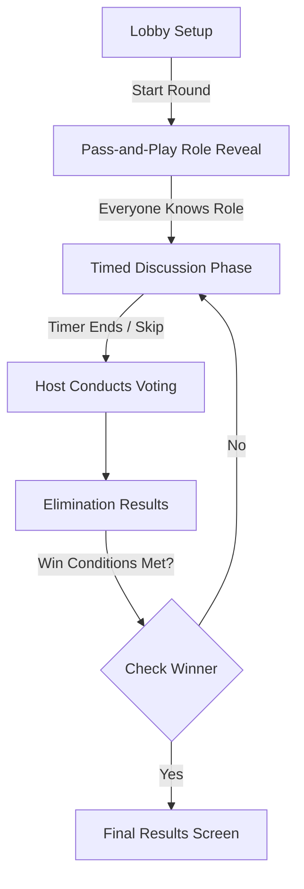

<div align="center">
  
</div>

<div align="center">
  <em>The title "IMPSTR" represents the players. The letter 'O' has been eliminated from the game, and we are highlighting 'M' because it is the imposter.</em>
</div>

<br>

<div align="center">

**A modern, offline-first social deduction game for Android built with Material Design 3**

[](https://m3.material.io/)
[](https://developer.android.com/jetpack/compose)
[](https://kotlinlang.org/)
[](#)
[](#)

</div>

---

## 📑 Table of Contents

- [📖 Overview](#-overview)
- [✨ Key Features](#-key-features)
- [🎯 How to Play](#-how-to-play)
- [🎨 Design System](#-design-system)
- [🧱 Architecture](#-architecture)
## Build Requirements
- **JDK 17**: This project uses Gradle toolchains and requires JDK 17 for builds.
- **Android Studio Koala (2024.1.1)** or newer is recommended.
- [🧠 State Management System](#-state-management-system)
- [🚀 Getting Started](#-getting-started)
- [🏗️ Build & Testing](#️-build--testing)
- [📝 License & Developer](#-license--developer)

---

## 📖 Overview

**IMPSTR** is an intensely strategic, pass-and-play social deduction game designed specifically for Android. Taking inspiration from party classics like Mafia and Among Us, IMPSTR streamlines the experience into a seamless, high-polish mobile app. 

Through a beautifully crafted Material Design 3 interface, 3 to 10 players share a single device. Everyone receives a secret word—except the **IMPSTR**. In the new **Stealth Mode**, the IMPSTR isn't just told they are the imposter; they receive a *decoy word* to help them blend in. It's a battle of wits: Crewmates must identify the IMPSTR without giving the word away, while the IMPSTR must play it cool to survive the vote!

---

## ✨ Key Features

| Feature | Description |
| :--- | :--- |
| 🎭 **Stealth Mode (New)** | Imposters receive a decoy word instead of an explicit "IMPOSTER" label, creating deeper bluffing opportunities. |
| 🎮 **Pass-and-Play** | Play together in the same room using just one device. Supports 3–10 players. |
| 🔒 **Fully Offline** | No internet required. Play anywhere without ads or tracking. |
| 🎨 **Material Design 3 Engine** | Powered by Jetpack Compose with fluid spring physics and dynamic theming. |
| 📂 **Rich Word Library** | 24+ word categories randomly generated for high replayability. |
| 🛠️ **Unified Design System** | Centralized tokens for consistent spacing, animations, and corner radii. |
| 🛡️ **Encrypted State** | Data is securely persisted via Android's `EncryptedSharedPreferences`. |

---

## 🎯 How to Play

### Flowchart of a Standard Match



### Game Phases Detailed

**1. Setup Phase**
- Customize player names and the total count of IMPSTRs.
- Choose between **Normal Mode** (explicit roles) and **Stealth Mode** (decoy word system).

**2. Pass & Reveal Phase**
- Pass the phone; each player flips an animated card.
- In **Normal Mode**, you see the secret word or "IMPOSTER".
- In **Stealth Mode**, you see either the *Secret Word* (Crewmate) or a *Decoy Word* (IMPSTR). 

**3. Discussion Phase**
- A tense 3-minute timer begins. Talk to figure out who doesn't know the word.
- *Tip: If you're the IMPSTR, use your decoy word to find common context with the crewmates!*

**4. Voting & Results Phase**
- The Host selects suspects. Eliminated roles are unmasked. 
- Play repeats until one side claims victory.

---

## 🎨 Design System

IMPSTR uses a centralized **Token-based Design System** (`DesignSystem.kt`) to ensure visual excellence:
- **Consistent Geometry**: All buttons use MD3 `medium` shapes (16dp), and bottom bars use specific 28dp top anchors.
- **Expressive Motion**: Spring physics (`DampingRatioMediumBouncy`) power every interaction.
- **Semantic Colors**: Custom color tokens (`ImposterRed`, `CrewmateGreen`) ensure tactical clarity.

> [!NOTE]
> For a deep dive into the UX philosophy, see our [Design Overview](Resources/DESIGN.md).

---

## 🧱 Architecture

IMPSTR leverages a robust **Model-View-ViewModel (MVVM)** pattern with **Unidirectional Data Flow (UDF)**. 

- **UI Layer**: Passive Jetpack Compose screens observer the `GameState`.
- **ViewModel Layer**: Houses the central `MutableStateFlow<GameState>`. Manages the game machine, timers, and voting logic.
- **Data Layer**: Clean repository pattern for encrypted storage and word pair generation (Stealth Mode).

---

## 🚀 Getting Started

### Prerequisites
- **Android Studio** Ladybug (or higher)
- **JDK 17** integration
- Minimum API Level 31 (Android 12) targeting API 36.

### Build via CLI
```bash
./gradlew assembleDebug
adb install -r app/build/outputs/apk/debug/app-debug.apk
```

### Build for Release (R8 Enabled)
```bash
./gradlew assembleRelease
```

---

## 🏗️ Build & Testing

We maintain a robust testing suite for win conditions and stealth logic.
```bash
./gradlew testDebugUnitTest
```

**Unit Test Highlights:**
| Test Class | Coverage |
|------------|----------|
| `GameViewModelTest` | Boundaries, role assignment, win evaluation, and **Stealth Mode** word pairs. |

---

## 📝 License & Developer

**Created and Maintained with 💙 by [Surajit Das](https://github.com/knownassurajit)**  
*This project is built for educational and personal use. All rights reserved © 2026 Surajit Das.*

<div align="center">
  <h3>Trust no one. Have fun! 🎭</h3>
</div>
