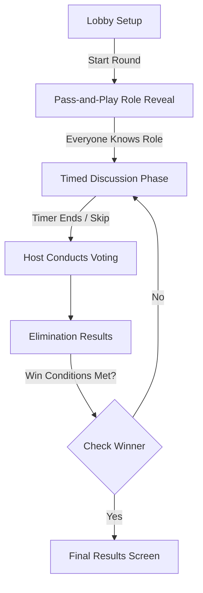

<div align="center">
  
</div>

<div align="center">
  <em>The title "IMPSTR" represents the players. The letter 'O' has been eliminated from the game, and we are highlighting 'M' because it is the imposter.</em>
</div>

<br>

<div align="center">

**A modern, offline-first social deduction game for Android built with Material Design 3**

[](https://m3.material.io/)
[](https://developer.android.com/jetpack/compose)
[](https://kotlinlang.org/)
[](https://developer.android.com/topic/security/data)
[](https://developer.android.com/about/versions/12/behavior-changes-12)
[](https://developer.android.com/about/versions/)
[](#)

</div>

---

## 📑 Table of Contents

- [📖 Overview](#-overview)
- [✨ Key Features](#-key-features)
- [🎯 How to Play](#-how-to-play)
- [🛠️ Technology Stack](#️-technology-stack)
- [🧱 Architecture](#-architecture)
- [🧠 State Management System](#-state-management-system)
- [🎨 Design System](#-design-system)
- [🔒 Security Enhancements](#-security-enhancements)
- [⚡ Performance Optimizations](#-performance-optimizations)
- [🚀 Getting Started](#-getting-started)
- [🏗️ Build & Testing](#️-build--testing)
- [📝 License & Developer](#-license--developer)

---

## 📖 Overview

**IMPSTR** is an intensely strategic, pass-and-play social deduction game designed specifically for Android. Taking inspiration from classic party games like Mafia and Among Us, IMPSTR streamlines the experience into a seamless, highly-polished mobile experience. 

Through a beautifully crafted Material Design 3 interface, 3 to 10 players share a single device. Everyone receives a secret word—except the **Imposter**, who receives nothing. It's a battle of wits: Crewmates must identify the Imposter without giving the word away, while the Imposter must blend in, decipher the category context, and survive the vote!

---

## ✨ Key Features

| Feature | Description |
| :--- | :--- |
| 🎮 **Pass-and-Play Multiplayer** | Play together in the same room using just one Android device. Supports 3–10 players. |
| 🔒 **Fully Offline Setup** | No internet connection required. Play anywhere, anytime, without ads or tracking. |
| 🎨 **Material Design 3 Engine** | Powered by Jetpack Compose. Fluid spring physics, dynamic theming, and immersive dark mode. |
| 📂 **Huge Library** | Over 24 expansive word categories, randomly generated to keep every round unpredictable. |
| ⚡ **Lifecycle-Aware Performance** | Bleeding-edge Compose implementations using `collectAsStateWithLifecycle` for zero background battery drain. |
| 🛡️ **Encrypted State** | Player configurations and data are securely persisted via Android's `EncryptedSharedPreferences`. |
| 🎯 **Tense Strategic Mechanics** | Integrated discussion timers, intense voting logic, and comprehensive elimination history tracking. |

---

## 🎯 How to Play

### Flowchart of a Standard Match



### Game Phases Detailed

**1. Setup Phase**
- Drag and drop player names to organize turn order.
- Select the total count of IMPSTRs (can scale with the size of your group).
- Agree on a category from the 24 available options.

**2. Pass & Reveal Phase**
- Pass the phone around the room.
- Each player taps to reveal a beautifully animated 3D flip-card.
- Memorize whether you are a **Crewmate** (shown the secret word) or the **IMPSTR**.

**3. Discussion Phase**
- A tense 3-minute timer begins.
- Players talk to figure out who doesn't know the word, while the IMPSTR tries to bluff.
- *Tip: Don't be too specific, or the IMPSTR will guess the word!*

**4. Voting & Results Phase**
- The Host takes the phone and selects the suspect(s).
- Eliminated players' roles are unmasked. 
- Play repeats until one side claims victory.

---

## 🛠️ Technology Stack

| Ecosystem | Technology | Details |
|-----------|-----------|---------|
| **Core App** | Jetpack Compose | Declarative UI framework leveraging Material 3 tokens. |
| **Language** | Kotlin 2.0.21 | Functional, null-safe, concise. |
| **Architecture** | MVVM | Strict separation of UI and business logic. |
| **Reactivity** | StateFlow & Coroutines | Unidirectional Data Flow pattern. |
| **Dependency Injection** | Hilt | Scoped view-models `@HiltViewModel`. |
| **Security** | Security-Crypto | Implementations of `AES256_GCM` algorithms. |
| **Build Tools** | Gradle Kotlin DSL | KSP code generation and robust build configurations. |

---

## 🧱 Architecture

IMPSTR leverages a robust, industry-standard **Model-View-ViewModel (MVVM)** pattern alongside an uncompromising **Unidirectional Data Flow (UDF)**. 

- **UI Layer (Jetpack Compose)**: Completely passive screens. They observe `GameState` through lifecycle-aware flows (`collectAsStateWithLifecycle`) and dispatch raw intents to the ViewModel.
- **ViewModel Layer (`GameViewModel`)**: Houses the central `MutableStateFlow<GameState>`. Calculates player shuffling, timer coroutines, and processes the voting algorithm.
- **Data & UseCase Layer**: Singular domains handling SharedPreferences cryptography and random word assignment protocols.

---

## 🧠 State Management System

The entire game state is encapsulated in an `@Stable` annotated data class, ensuring maximum Jetpack Compose stability and minimizing unnecessary recompositions.

```kotlin
@Stable
data class GameState(
    val phase: GamePhase = GamePhase.SETUP,
    val players: List<PlayerState> = emptyList(),
    val category: String = "Random Words",
    val secretWord: String = "",
    val imposterNames: List<String> = emptyList(),
    val imposterCount: Int = 1,
    // ... Timer metrics, elimination tracking, and UI animation flags
)
```

Transitions between `GamePhase` states trigger smooth animated content crossfades managed by Jetpack Compose.

---

## 🎨 Design System

**IMPSTR** breaks away from standard, boring mobile apps by prioritizing visual excellence:
- **AMOLED-Optimized Dark Mode**: Black and deep navy gradient meshes prevent eye strain during late-night party sessions.
- **Expressive Typography**: Bold, aggressive fonts match the tense atmosphere. 
- **Micro-Animations**: Uses customized Compose spring physics (`DampingRatioMediumBouncy`) for everything from card flips to drag-and-drop mechanics.

---

## 🔒 Security Enhancements

We take user data seriously, even for party games.
- **EncryptedSharedPreferences**: Player names, customized rules, and local preferences are encrypted via `MasterKey.KeyScheme.AES256_GCM`.
- **Manifest Lockdowns**: `android:allowBackup="false"` is strictly enforced, preventing malicious extraction of the applications data stack via ADB operations.

---

## ⚡ Performance Optimizations

1. **Lifecycle Aware Collection**: Replaced legacy StateFlow collections with `collectAsStateWithLifecycle()`. If the user minimizes the app during the 3-minute discussion, the UI cleanly detaches, preserving CPU cycles.
2. **`@Stable` Annotations**: Collections involving `PlayerState` lists are explicitly declared as immutable, halting redundant recompositions when the fast-ticking timer updates.

---

## 🚀 Getting Started

### Prerequisites

- **Android Studio** Ladybug (or higher)
- **JDK 17** integration
- Minimum API Level 31 (Android 12) targeting API 36.

### Installation

```bash
# 1. Clone the repository
git clone https://github.com/knownassurajit/impstr.git

# 2. Enter directory
cd IMPSTR

# 3. Open in Android Studio or build via CLI
./gradlew assembleDebug

# 4. Install via ADB
adb install -r app/build/outputs/apk/debug/app-debug.apk
```

---

## 🏗️ Build & Testing

The project boasts a robust testing suite verifying edge cases relating to win conditions, player bounds, and cryptographic fallbacks.

```bash
# Execute local unit tests
./gradlew testDebugUnitTest
```

**Project Structure:**

```
├── Resources/
│   ├── README.md                       # Internal docs index
│   └── icon_play_store.png             # Play Store icon asset
│
└── IMPSTR/                             # Android project root
    ├── build.gradle.kts                # Project-level plugin versions
    ├── settings.gradle.kts             # Module inclusion and dependency resolution
    ├── app/                            # Main application module
    │   ├── build.gradle.kts            # App-level dependencies and configurations
    │   └── src/
    │       ├── main/
    │       │   ├── AndroidManifest.xml # App permissions and component declarations
    │       │   ├── java/com/game/impstr/
    │       │   │   ├── IMPSTRApplication.kt  # Hilt application entry point
    │       │   │   ├── MainActivity.kt     # Main activity hosting Compose UI
    │       │   │   ├── data/             # Data sources (e.g., SharedPreferences, word lists)
    │       │   │   ├── di/               # Dependency Injection modules (Hilt)
    │       │   │   ├── domain/           # Business logic, UseCases, and core models
    │       │   │   ├── ui/               # UI layer (Compose screens, ViewModels)
    │       │   │   └── util/             # Utility functions and extensions
    │       │   └── res/                # Android resources (layouts, drawables, values)
    │       └── test/
    │           └── java/com/game/impstr/ui/viewmodel/
    │               └── GameViewModelTest.kt        # JUnit 4 unit tests (6 tests)
    └── gradle/                         # Gradle wrapper files
```

**Tested Scenarios Include:**
- Player bounds verification (minimum 3, cap logic enforcing max IMPSTRs).
- Mocked cryptographic fallback capabilities if Android Keystore fails.
- Winning evaluations for extreme edge cases (e.g. Parity between Crewmates/IMPSTRs).

**Unit Test Coverage:**

| Test | Validates |
|------|-----------|
| `initial state is correct` | Default `GameState` values |
| `updatePlayerCount respects minimums and IMPSTR limits` | Player count boundaries (min 3, IMPSTR ceiling) |
| `startGame assigns roles correctly` | Correct IMPSTR count assigned randomly |
| `voting eliminates players` | `castVote()` marks player eliminated, transitions to `VOTING_RESULTS` |
| `win condition - crewmates win` | Eliminating last IMPSTR → `winner = "Crewmates"` |
| `win condition - IMPSTRs win` | IMPSTRs reaching parity → `winner = "IMPSTRs"` |

```bash
cd IMPSTR
./gradlew testDebugUnitTest   # All 6 tests pass ✅
```

---

## 📝 License & Developer

**Created and Maintained with 💙 by [Surajit Das](https://github.com/knownassurajit)**  
*This project is built for educational and personal use. All rights reserved © 2026 Surajit Das.*

<br>
<div align="center">
  <h3>Trust no one. Have fun! 🎭</h3>
</div>
