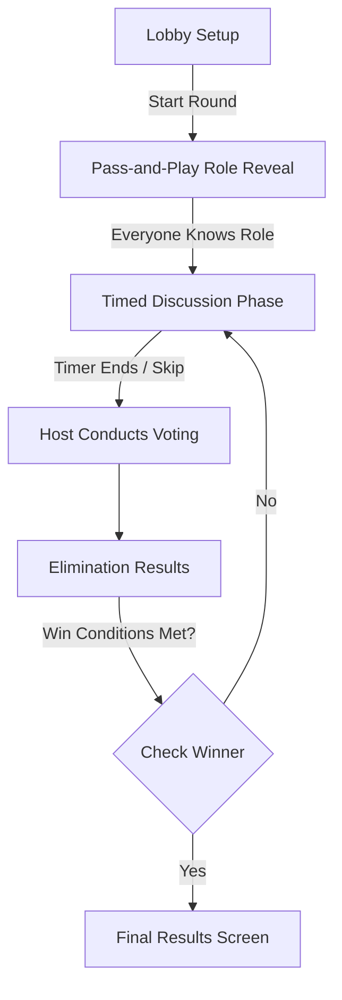

<div align="center">
  
</div>

<div align="center">
  <em>The title "IMPSTR" represents the players. The letter 'O' has been eliminated from the game, and we are highlighting 'M' because it is the imposter.</em>
</div>

<br>

<div align="center">

**A modern, offline-first social deduction game for Android built with Material Design 3**

[](https://m3.material.io/)
[](https://developer.android.com/jetpack/compose)
[](https://kotlinlang.org/)
[](#)
[](#)

</div>

---

## 📑 Table of Contents

- [📖 Overview](#-overview)
- [✨ Key Features](#-key-features)
- [🎯 How to Play](#-how-to-play)
- [🎨 Design System](#-design-system)
- [🧱 Architecture](#-architecture)
- [🔧 Build Requirements](#-build-requirements)
- [🧠 State Management System](#-state-management-system)
- [🚀 Getting Started](#-getting-started)
- [🏗️ Build & Testing](#️-build--testing)
- [⚙️ CI/CD](#️-cicd)
- [📝 License & Developer](#-license--developer)

---

## 📖 Overview

**IMPSTR** is an intensely strategic, pass-and-play social deduction game designed specifically for Android. Taking inspiration from party classics like Mafia and Among Us, IMPSTR streamlines the experience into a seamless, high-polish mobile app. 

Through a beautifully crafted Material Design 3 interface, 3 to 10 players share a single device. Everyone receives a secret word—except the **IMPSTR**. In the new **Stealth Mode**, the IMPSTR isn't just told they are the imposter; they receive a *decoy word* to help them blend in. It's a battle of wits: Crewmates must identify the IMPSTR without giving the word away, while the IMPSTR must play it cool to survive the vote!

---

## ✨ Key Features

| Feature | Description |
| :--- | :--- |
| 🎭 **Stealth Mode (New)** | Imposters receive a decoy word instead of an explicit "IMPOSTER" label, creating deeper bluffing opportunities. |
| 🎮 **Pass-and-Play** | Play together in the same room using just one device. Supports 3–10 players. |
| 🔒 **Fully Offline** | No internet required. Play anywhere without ads or tracking. |
| 🎨 **Material Design 3 Engine** | Powered by Jetpack Compose with fluid spring physics and dynamic theming. |
| 📂 **Rich Word Library** | 24+ word categories randomly generated for high replayability. |
| 🛠️ **Unified Design System** | Centralized tokens for consistent spacing, animations, and corner radii. |
| 🛡️ **Encrypted State** | Data is securely persisted via Android's `EncryptedSharedPreferences`. |

---

## 🎯 How to Play

### Flowchart of a Standard Match


```mermaid
graph TD;
    A[Lobby Setup] -->|Start Round| B[Pass-and-Play Role Reveal];
    B -->|Everyone Knows Role| C[Timed Discussion Phase];
    C -->|Timer Ends / Skip| D[Host Conducts Voting];
    D --> E[Elimination Results];
    E -->|Win Conditions Met?| F{Check Winner};
    F -- Yes --> G[Final Results Screen];
    F -- No --> C;
```

### Game Phases Detailed

**1. Setup Phase**
- Customize player names and the total count of IMPSTRs.
- Choose between **Normal Mode** (explicit roles) and **Stealth Mode** (decoy word system).

**2. Pass & Reveal Phase**
- Pass the phone; each player flips an animated card.
- In **Normal Mode**, you see the secret word or "IMPOSTER".
- In **Stealth Mode**, you see either the *Secret Word* (Crewmate) or a *Decoy Word* (IMPSTR). 

**3. Discussion Phase**
- A tense 3-minute timer begins. Talk to figure out who doesn't know the word.
- *Tip: If you're the IMPSTR, use your decoy word to find common context with the crewmates!*

**4. Voting & Results Phase**
- The Host selects suspects. Eliminated roles are unmasked. 
- Play repeats until one side claims victory.

---

## 🎨 Design System

IMPSTR uses a centralized **token-based Material 3** system (`DesignSystem.kt`, `Color.kt`, `Type.kt`, `Shapes.kt`):
- **Type**: Material 3 type scale set in **Poppins** (the only valid bundled TrueType family).
- **Spacing**: 4dp grid / 8dp rhythm. Compact page margins 16dp, sheets 24dp, 48dp minimum touch targets, 56dp primary CTAs.
- **Color**: Independent light and dark tonal palettes from a cyan-blue seed, plus a stealth neon scheme. Dynamic color (Material You) on Android 12+.
- **Shape**: Expressive corners (16/20/28dp) on cards, buttons, and sheets.
- **Motion**: Emphasized easing and spatial springs on lobby cards, splash, and navigation.

> [!NOTE]
> For a deep dive into the UX philosophy, see our [Design Overview](Resources/DESIGN.md).

---

## 🧱 Architecture

IMPSTR leverages a robust **Model-View-ViewModel (MVVM)** pattern with **Unidirectional Data Flow (UDF)**. 

- **UI Layer**: Passive Jetpack Compose screens observer the `GameState`.
- **ViewModel Layer**: Houses the central `MutableStateFlow<GameState>`. Manages the game machine, timers, and voting logic.
- **Data Layer**: Clean repository pattern for encrypted storage and word pair generation (Stealth Mode).

---

## 🔧 Build Requirements

- **JDK 17**: This project uses Gradle toolchains and requires JDK 17 for builds.
- **Android Studio Koala (2024.1.1)** or newer is recommended.

---

## 🚀 Getting Started

### Prerequisites
- **Android Studio** Ladybug (or higher)
- **JDK 17** integration
- Minimum API Level 31 (Android 12) targeting API 36.

### Build via CLI
```bash
./gradlew assembleDebug
adb install -r app/build/outputs/apk/debug/app-debug.apk
```

### Build for Release (R8 Enabled)
```bash
./gradlew assembleRelease
```

---

## 🏗️ Build & Testing

We maintain a robust testing suite for win conditions, stealth logic, design tokens, and device UI flows.
```bash
./gradlew testDebugUnitTest
./gradlew connectedDebugAndroidTest
```

**Test Highlights:**
| Test Class | Coverage |
|------------|----------|
| `GameViewModelTest` | Boundaries, role assignment, win evaluation, full setup→result lifecycle, and **Stealth Mode** word pairs. |
| `DesignTokensTest` | 4dp spacing grid, 48dp touch targets, M3 type scale, light/dark contrast. |
| `GameFlowComposeTest` | JVM Compose lobby → reveal → discussion → vote (Robolectric). |
| `GameFlowE2ETest` | Instrumented lobby → reveal → discussion → vote → results, plus branded color/type checks. |

---

## ⚙️ CI/CD

IMPSTR ships through a **develop → master** pipeline, driven by a single containerized workflow at [`.github/workflows/ci-cd.yml`](.github/workflows/ci-cd.yml).

### Branch model
- **`develop`** — active development branch. All feature work merges here via pull request.
- **`master`** — production branch. Only promoted from `develop` via pull request once it's release-ready.

### Pipeline jobs

| Job | Trigger | What it does |
|---|---|---|
| **`test`** | Every push to `develop`/`master`, and every pull request | Runs `testDebugUnitTest` + `lintDebug` inside an `eclipse-temurin:17-jdk-jammy` container and uploads the reports as a build artifact. This is the CI signal for **every** PR, including feature branches into `develop`. |
| **`debug-release`** | Push to `develop` (after `test` passes) | Builds an **unsigned debug APK**, extracts the version from Gradle, generates a changelog since the last tag, and publishes it as a **GitHub pre-release** for internal testing. |
| **`pr-summary`** | Pull requests targeting `master` | Re-runs lint + unit tests, then posts a detailed **`$GITHUB_STEP_SUMMARY`** and a PR comment with pass/fail status, current version, and a changelog preview of everything since the last stable release — so a `develop → master` PR is reviewable at a glance. |
| **`stable-release`** | Push to `master` (after `test` passes) | Runs `testReleaseUnitTest` + `lintRelease`, builds `assembleRelease`, **signs** the APK via [`r0adkll/sign-android-release`](https://github.com/r0adkll/sign-android-release), publishes it as a **GitHub Stable Release** (`impstr-release-v<version>.apk`), and — if Play Console credentials are configured — publishes it to the **Google Play internal testing track** via [`r0adkll/upload-google-play`](https://github.com/r0adkll/upload-google-play). |

### Release artifacts

| Source | Naming | Type |
|---|---|---|
| `develop` pre-release | `impstr-debug-v<version>.apk` | Unsigned debug build |
| `master` stable release | `impstr-release-v<version>.apk` | Signed release build |

### Required secrets

| Secret | Used for |
|---|---|
| `SIGNING_KEY`, `ALIAS`, `KEY_STORE_PASSWORD`, `KEY_PASSWORD` | Signing the release APK on `master` |
| `PLAY_CONSOLE_JSON` | Publishing to the Google Play internal track (`com.knownassurajit.app.game.impstr`). If unset, the Play publish step is skipped as a safe no-op — nothing else in the pipeline is blocked. |

---

## 📝 License & Developer

**Created and Maintained with 💙 by [Surajit Das](https://www.linkedin.com/in/knownassurajit/)**  
*Licensed under the [GNU General Public License v3.0](LICENSE). Copyright © 2026 Surajit Das.*

<div align="center">
  <h3>Trust no one. Have fun! 🎭</h3>
</div>
